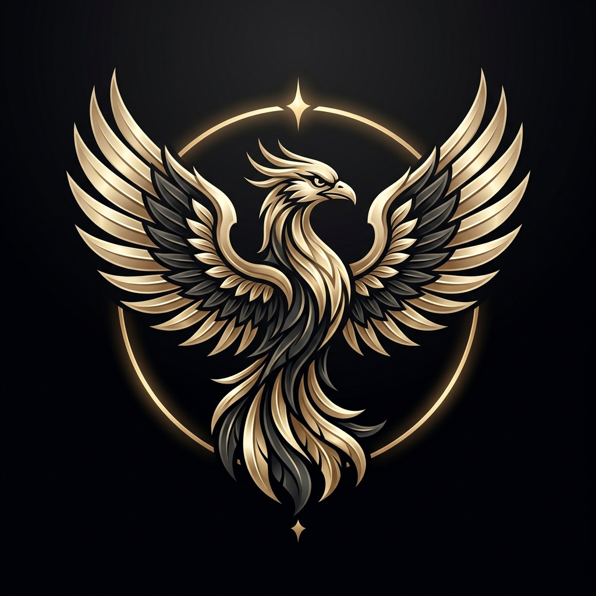

# ARTI AI — Autonomous Intelligence

> **Private AI Product**  
> *"This AI is only for me. Simple on the surface. Extremely powerful underneath."*



## Overview

ARTI AI is a private, ultra-premium AI command center designed with a unified Dark + Classic + Luxurious + Futuristic + Cinematic + Elegant visual language.

### Step 1: Hyper-Ultra Home UI Foundation

- **Display Target**: Tuned for 16:9 desktop viewport with stable responsive scaling.
- **Cinematic Environment**: Majestic landscape featuring dark mountains, calm reflective water, horizon warm glow, futuristic castle city with spires, and a celestial planetary sphere.
- **Left Navigation Sidebar**:
  - ARTI AI luxury phoenix emblem branding and collapse control (`>`).
  - 16 Primary navigation items (Home, Chat, Projects, Websites, Apps, Games, Images, Videos, Music, Documents, Research, Learning, Agents, Tools, Knowledge Base, Marketplace).
  - 6 Secondary navigation items (Active Agents, Recent Projects, Quick Actions, Task Control Center, System Status, AI Command Center).
  - 2 Utility navigation items (Settings, Help & Support).
  - Warm-gold capsule highlight for the active `Home` state.
  - Collapse / expand support without destructive layout shift.
- **Top Bar**:
  - Integrated wide search field with `Ctrl + K` shortcut indicator.
  - Theme control & notification indicator.
  - **Magic Mode** UI button with gold border, spark icon, and indicator.
  - **Profile Area**: Clean typography ("Ramakanth", "Private Mode", dropdown indicator) without avatars or portraits.
- **Central Hero Canvas**:
  - Greeting: "Hello, Ramakanth" with subtle gold crown indicator.
  - Main Heading: "What would you like to **create** today?" with refined champagne-gold metallic gradient on "create".
  - Subtitle: "Dream bigger. Build faster. Explore further."
- **Prompt Field & Actions**:
  - Centered translucent dark prompt pill with spark icon and circular gold send button.
  - Compact quick action pills: *Create Project*, *Search*, *Generate*, *Explore*, *More*.
- **Subtle Luxury Footer**:
  - Horizontal micro-copy framed by a refined gold hairline accent: `ARTI AI · Private & Encrypted · Autonomous Intelligence · Infinite Possibilities`.

## Tech Stack

- **Framework**: React 19 + TypeScript
- **Bundler**: Vite 8
- **Icons**: Lucide React
- **Typography**: Cinzel, Plus Jakarta Sans, Inter

## Getting Started

```bash
# Install dependencies
npm install

# Start development server
npm run dev

# Build for production
npm run build

# Run linter
npm run lint
```
